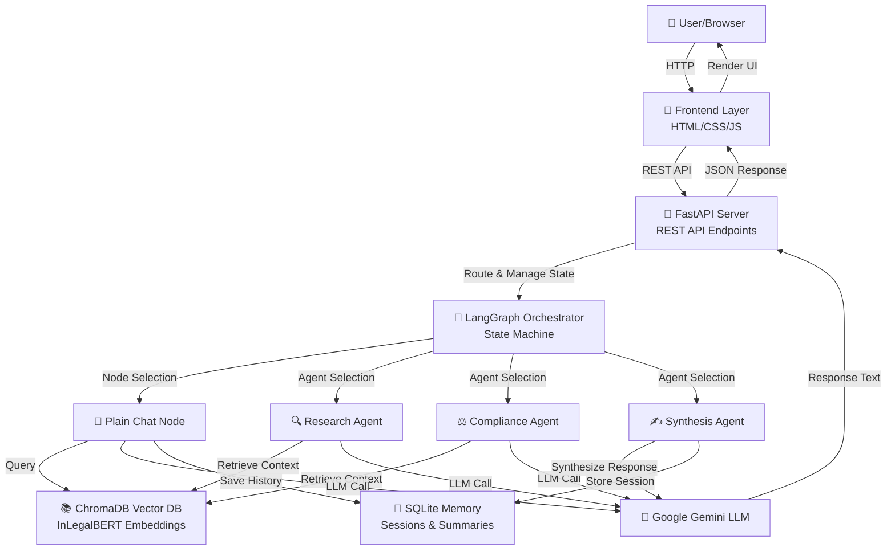
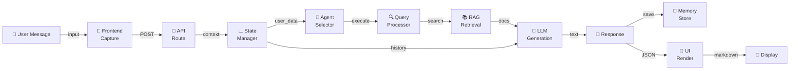
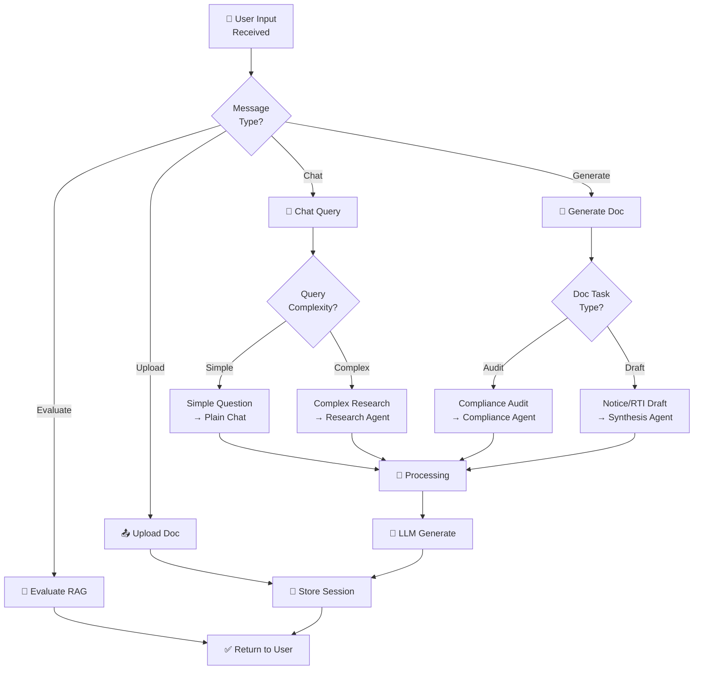

# ⚖️ Nyaya Agent — AI-Powered Indian Legal Assistant

<div align="center">


**Nyaya Agent** is an advanced AI legal assistant specializing in Indian law — designed for lawyers, students, and citizens navigating the Indian justice system.

</div>

---

## 🌟 What Is Nyaya Agent?

Nyaya Agent combines a **Retrieval-Augmented Generation (RAG)** pipeline with **LangGraph AI orchestration** and **Gemini LLM** to provide:

- 🔍 Intelligent legal research across Indian statutes and case law
- 📄 Automated legal document drafting (notices, RTI, compliance audits)
- 🧑‍⚖️ Persona-based legal guidance (Lawyer, Student, Explorer, Researcher)
- 🌐 Multilingual support (English, Hindi, Bengali, Malayalam, and more)
- 💾 Persistent session memory with context summarization

---

## 🚀 Live Demo

| Environment | URL |
|---|---|
| **Beta (Latest)** | https://huggingface.co/spaces/SeriousSam07/nyaya-agent-beta |
| **Stable** | https://huggingface.co/spaces/SeriousSam07/nyaya-agent |

---

## 🛠️ Tech Stack

| Layer | Technology |
|---|---|
| **LLM** | Google Gemini (via LangChain) |
| **AI Orchestration** | LangGraph (stateful multi-agent graph) |
| **RAG / Vector DB** | ChromaDB + InLegalBERT embeddings |
| **Backend** | FastAPI + Uvicorn |
| **Memory** | SQLite (session memory + rolling summaries) |
| **Frontend** | Vanilla HTML/CSS/JS (no framework) |
| **Containerization** | Docker |
| **Hosting** | Hugging Face Spaces |
| **RAG Evaluation** | RAGAS framework |

---

## 🏗️ Architecture Overview

```
┌─────────────────────────────────────────────────────────────┐
│                     FRONTEND (Browser)                       │
│         HTML + Vanilla CSS/JS | Lucide Icons | Marked.js     │
└────────────────────────┬────────────────────────────────────┘
                         │ HTTP (REST API)
┌────────────────────────▼────────────────────────────────────┐
│                  FastAPI Backend (server.py)                  │
│   /api/chat  /api/sessions  /api/upload  /api/evaluate_rag   │
└────────────────────────┬────────────────────────────────────┘
                         │
          ┌──────────────▼──────────────┐
          │      LangGraph Agent Graph   │
          │  ┌───────────────────────┐  │
          │  │   Plain Chat Node     │  │
          │  │   Research Agent      │  │
          │  │   Compliance Agent    │  │
          │  │   Synthesis Agent     │  │
          │  └───────────────────────┘  │
          └──────┬──────────────┬───────┘
                 │              │
    ┌────────────▼──┐    ┌──────▼──────────┐
    │  ChromaDB RAG │    │  SQLite Memory  │
    │  (Legal Docs) │    │  (Sessions +    │
    │  InLegalBERT  │    │   Summaries)    │
    └───────────────┘    └─────────────────┘
```

### Enhanced Component Diagram



### Data Flow Diagram



### Agent Decision Tree



---

## ✨ Key Features

### 1. 🧑‍⚖️ Persona-Based Legal Assistance
Users can switch between 4 personas that change the AI's tone, depth, and response style:
- **Lawyer** — High-precision statutory interpretation
- **Student** — Educational explanations with case law
- **Explorer** — Simple, accessible legal guidance
- **Researcher** — Deep academic and citation-heavy analysis

### 2. 📚 RAG Pipeline (Retrieval-Augmented Generation)
- Upload PDFs and text files that get ingested into ChromaDB
- Legal queries retrieve relevant document chunks using InLegalBERT embeddings
- Retrieved context is injected into the LLM prompt for grounded responses

### 3. 💬 Session Memory
- Each chat session has rolling persistent memory (SQLite)
- Older messages are automatically summarized to stay within context limits
- Max 6 sessions stored; oldest auto-pruned on new messages

### 4. 🗂️ Chat History Management
- View up to 6 recent sessions in the collapsible sidebar
- Click any session to reload its full conversation
- Delete individual sessions with the trash icon

### 5. 📄 Document Generation
- Generate legal notices, RTI applications, and compliance audits
- Download as **.DOC** (Word format) or **view/print as PDF** via in-page modal

### 6. 🔬 RAG Evaluation
- Built-in RAGAS-based pipeline evaluator
- Tests context precision and recall against legal benchmarks
- Scores the retrieval quality out of 5.0

### 7. 🌐 Multilingual Support
- Detects user language and adapts responses
- Supported: English, Hindi, Bengali, Malayalam, Tamil, and more

---

## 📁 Project Structure

```
/
├── Dockerfile                  # Container definition
├── README.md                   # This file
├── GUIDELINES.md               # Contributor & architecture guide
├── WORKFLOW.md                 # Development workflow & setup
├── requirements.txt            # Python dependencies
├── server.py                   # FastAPI app (all API endpoints)
├── agent_state.py              # LangGraph state schema
├── frontend/
│   ├── index.html              # Main UI (single-page app)
│   ├── style.css               # All styling
│   └── script.js               # All frontend logic
└── nyaya_agent/
    ├── graph.py                # LangGraph pipeline definition
    ├── llm.py                  # LLM (Gemini) configuration
    ├── settings.py             # App settings & environment vars
    ├── retrieval.py            # ChromaDB RAG retriever
    ├── evaluate_rag.py         # RAGAS evaluation pipeline
    ├── agents/
    │   ├── research.py         # Legal research agent
    │   ├── compliance.py       # Compliance audit agent
    │   └── synthesis.py        # Response synthesis agent
    ├── nodes/
    │   └── plain_chat.py       # Default conversational node
    └── memory/
        └── sqlite_store.py     # Session memory (SQLite)
```

---

## ⚙️ Environment Variables

The app requires the following secrets (set in HF Space Secrets or `.env` file):

| Variable | Description |
|---|---|
| `GEMINI_API_KEY` | Google Gemini API key |
| `INDIANKANOON_API_KEY` | Indian Kanoon legal database API key |

> ⚠️ **Never commit your `.env` file to git.** It is in `.gitignore`.

---

## 🐳 Running Locally

```bash
# 1. Clone the repo
git clone https://github.com/the-deshpande/NyayaAgent
cd NyayaAgent

# 2. Create environment file
cp .env.example .env
# Edit .env and add your API keys

# 3. Run with Docker
docker build -t nyaya-agent .
docker run -p 7860:7860 --env-file .env nyaya-agent

# 4. Open in browser
# http://localhost:7860
```

---

## 🤝 Contributing

See [GUIDELINES.md](GUIDELINES.md) for architecture details and [WORKFLOW.md](WORKFLOW.md) for the development workflow.

---

## 📜 License

This project is for educational and research purposes. All legal content is AI-generated and should be verified by a qualified legal professional.

> *Satyameva Jayate — Truth alone triumphs.*
