# Nyaya Agent — Setup and Operations

This guide matches the implementation in the repository: **ChromaDB** for corpus storage, **SQLite** for chat memory (six messages plus rolling summary), a **`CHROMA_READY`** toggle, **LangGraph** routing, and **Streamlit** as the main UI.

---

## 1. What was implemented (step by step)

1. **`nyaya_agent/settings.py`**  
   Loads `.env` and exposes `CHROMA_READY`, paths for Chroma/SQLite, `CHAT_MODEL_ID`, `CHROMA_COLLECTION`, and `MAX_REACT_ITERATIONS` (default **6** for the Research tool loop).

2. **`nyaya_agent/retrieval.py`**
   - **`Retriever`**: no-op search when Chroma is off.
   - **`ChromaRetriever`**: `chromadb.PersistentClient` + `collection.query(query_texts=…)`; maps hits to `RetrievedDoc`.
   - **`get_retriever()`**: returns **`ChromaRetriever`** only when `CHROMA_READY` is true; otherwise **`Retriever`**.

3. **`nyaya_agent/memory/sqlite_store.py`**
   - Tables `sessions` (per-session **summary**) and `messages` (chronological rows).
   - After each **user + assistant** pair, if total rows **> 6**, the oldest rows are **deleted** and their text is **merged** into `sessions.summary` (LLM compression when the API is available; otherwise concatenation with a length cap).

4. **`nyaya_agent/agents/research.py`**  
   Research agent runs a **ReAct-style** loop: `bind_tools` + up to **`MAX_REACT_ITERATIONS`** rounds of tool calls to **`search_legal_corpus`**, then returns merged **`retrieved`** chunks.

5. **`nyaya_agent/nodes/plain_chat.py`**  
   When **`CHROMA_READY`** is false, the graph runs this node only: Gemini (or configured chat model) answers using **summary + recent six messages** from state, with an explicit system prompt that retrieval is off.

6. **`nyaya_agent/graph.py`**
   - **Conditional edge from `START`**: `rag` if `CHROMA_READY` else `plain`.
   - **RAG path:** `research` → `compliance` → `synthesis` → `END`.
   - **Plain path:** `plain_chat` → `END`.

   

7. **`nyaya_agent/agents/synthesis.py`**  
   Builds the JSON **memo** and sets **`assistant_message`** (short chat blurb via the same chat model when the API works; otherwise a deterministic fallback).

8. **`nyaya_agent/evaluate_rag.py`**  
   Script to evaluate RAG pipeline retrieval using `ragas`.

9. **`streamlit_app.py`**  
   Streamlit UI: sidebar status, optional demo seed button, chat with **SQLite** session id, invokes **`build_graph()`** with **`conversation_summary`** and **`recent_messages`**, then **`append_exchange`**.

10. **`run_nyaya.py`**  
    CLI: loads SQLite context for session **`cli`**, invokes graph, prints **memo** JSON, stores **assistant_message**, optional follow-up terminal chat.

11. **Dependencies**  
    **`chromadb`** and **`streamlit`** added to `requirements.txt` and `environment.yml`.

---

## 2. Dependencies (Python packages)

| Package                  | Role                                               |
| :----------------------- | :------------------------------------------------- |
| `langgraph`              | State graph, `START` / `END`, conditional routing  |
| `langchain`              | `init_chat_model`, orchestration helpers           |
| `langchain-core`         | Messages, tools, tool calling                      |
| `langchain-google-genai` | Gemini backend for default `CHAT_MODEL_ID`         |
| `chromadb`               | Embedded vector store and default query embeddings |
| `streamlit`              | Web UI                                             |
| `python-dotenv`          | Load `.env`                                        |
| `pydantic`               | Typed validation where used                        |

**stdlib:** `sqlite3` (no pip install).

---

## 3. Tasks for you to run (get the project up)

### Step A — Environment

1. Install **Anaconda** or **Miniconda** (already assumed).
2. From the project root `NyayaAgent`:

   ```powershell
   conda env create -f environment.yml
   ```

   If the environment already exists:

   ```powershell
   conda activate nyaya-langgraph
   pip install -r requirements.txt
   ```

3. Copy **`.env.example`** to **`.env`** and set at least:
   - **`GOOGLE_API_KEY`** — required for default Gemini chat/agents.

### Step B — Chroma off (plain chat only)

1. In **`.env`**, set **`CHROMA_READY=false`** (default in example).
2. Run Streamlit:

   ```powershell
   conda activate nyaya-langgraph
   streamlit run streamlit_app.py
   ```

3. Chat in the browser. SQLite file appears under **`data/`** (see `SQLITE_PATH`).

### Step C — Chroma on (RAG path)

1. **Create data directory** (optional; Chroma/SQLite code creates parents as needed):

   ```powershell
   mkdir data -ErrorAction SilentlyContinue
   ```

2. **Evaluate Retrieval** (optional smoke test):

   You can use the **“Evaluate RAG Pipeline”** button in the Streamlit sidebar to test the retrieval quality with `ragas`.

3. In **`.env`**, set **`CHROMA_READY=true`**.
4. **Restart** Streamlit (settings are read at import time).
5. Open the app again; queries should hit **Research → Compliance → Synthesis** and show a JSON memo expander when retrieval runs.

### Step D — CLI smoke test

```powershell
conda activate nyaya-langgraph
python run_nyaya.py "What are broker KYC obligations?"
```

After the memo prints, you can enter optional terminal chat (`y` / `n`).

### Step E — Real corpus (your work)

The repo does **not** ship Indian Kanoon / SEBI / Gazette ingestion. You will need to:

1. Implement ingestion jobs that **chunk** and **`upsert`** into Chroma with metadata keys matching `ChromaRetriever` (`source_type`, `title`, `citation`, `url`).
2. Tune **`CHROMA_COLLECTION`** / **`CHROMA_PERSIST_DIR`** if you use non-default paths.
3. Re-run the app with **`CHROMA_READY=true`** after ingestion.

---

## 4. Operational notes

- **Restart after changing `CHROMA_READY`** so `nyaya_agent.settings` reloads.
- **Demo seed text** is illustrative only, not legal authority.
- **Compliance agent** is still a deterministic scaffold; full clause engine is a later phase.
- **Research agent** is the only node with a multi-round **tool** loop capped at **`MAX_REACT_ITERATIONS`**; Compliance/Synthesis remain single-pass in code (extend similarly when you add tools there).

---

## 5. Troubleshooting

| Symptom                         | Check                                                                     |
| :------------------------------ | :------------------------------------------------------------------------ |
| `ModuleNotFoundError: chromadb` | `pip install chromadb` inside the conda env                               |
| Gemini errors                   | `GOOGLE_API_KEY` in `.env`; billing / model access for `CHAT_MODEL_ID`    |
| Empty retrieval                 | Collection empty → run seed or real ingestion; verify `CHROMA_READY=true` |
| Streamlit import errors         | Run from project root so `nyaya_agent` is importable                      |
